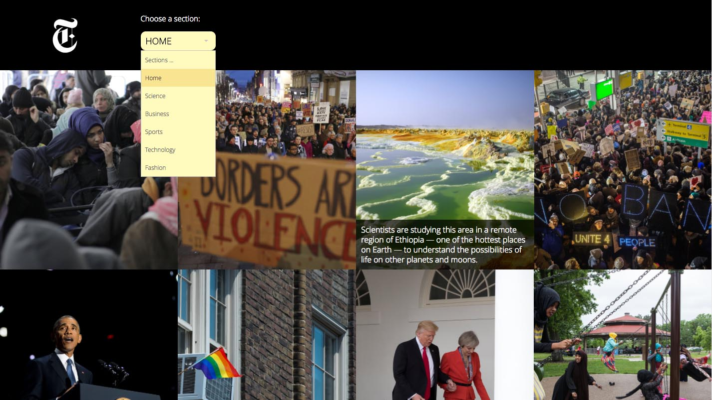

# Instanews App (project02)
create a responsive website that allows a user to filter top news story
categories via the New York Times API.

## Technologies used:
* A mobile-first responsive layout
* New York Times API
* jQuery plugin for this such as Selectric
* jQuery and CSS3-based animation
* Use Ajax to fetch data from the NYT